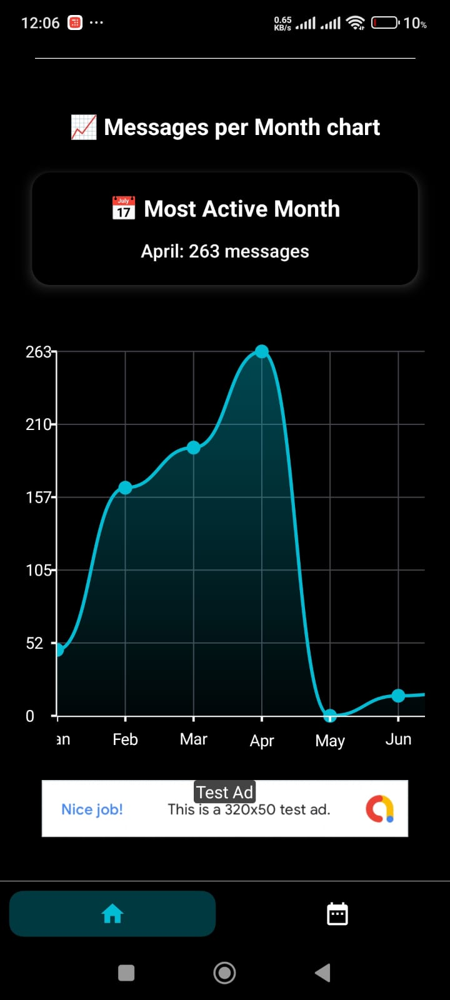
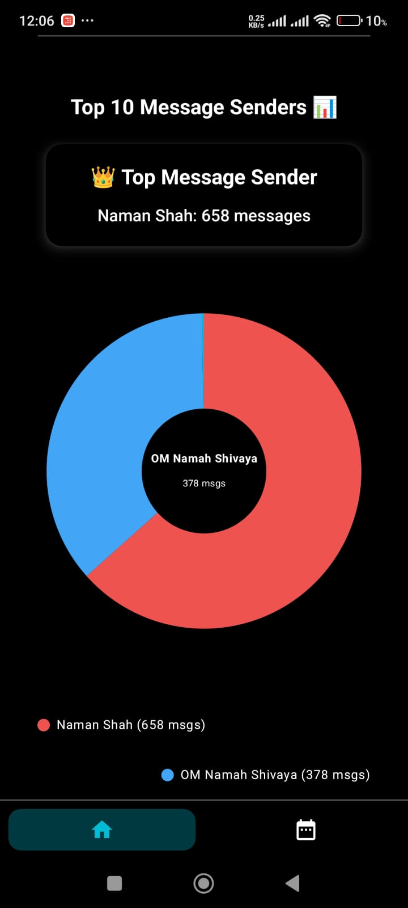
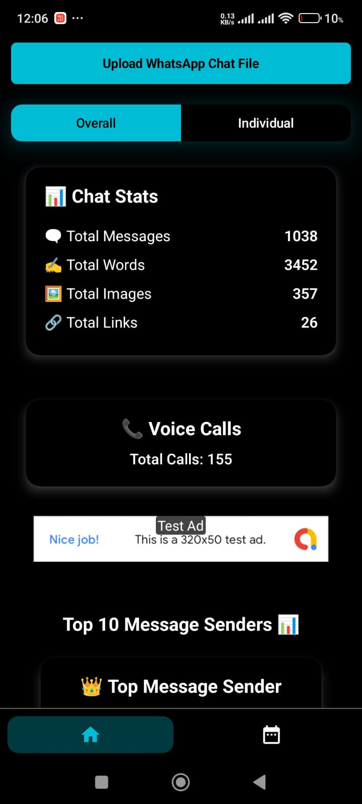
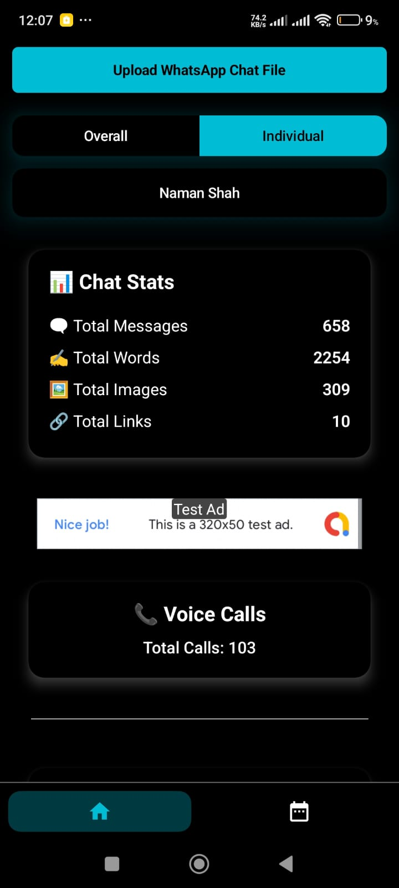
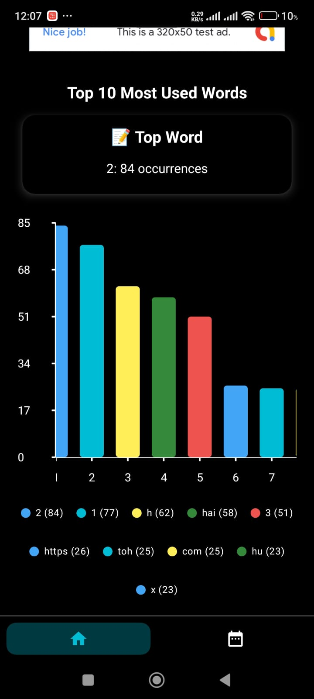
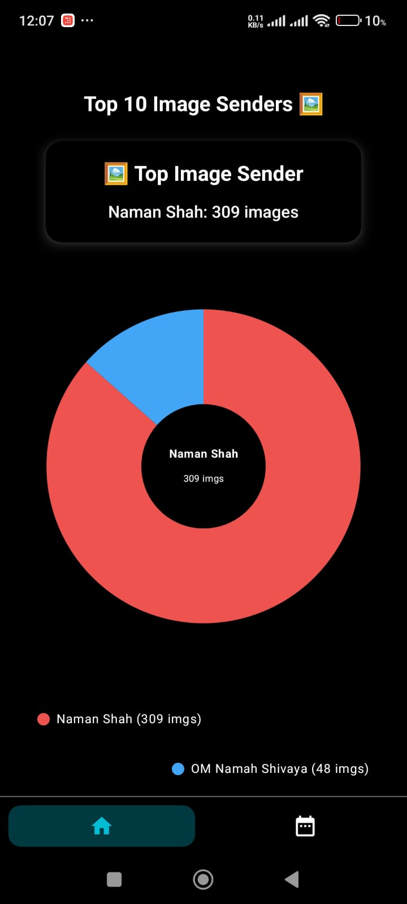
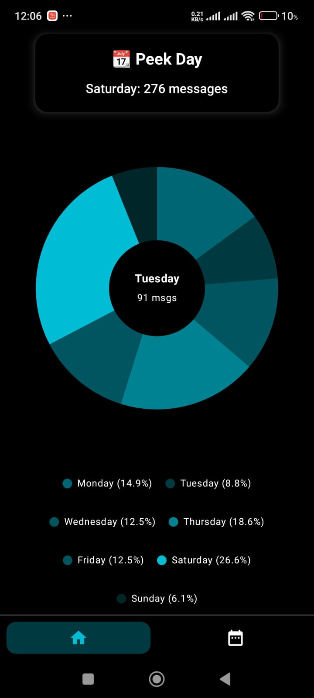
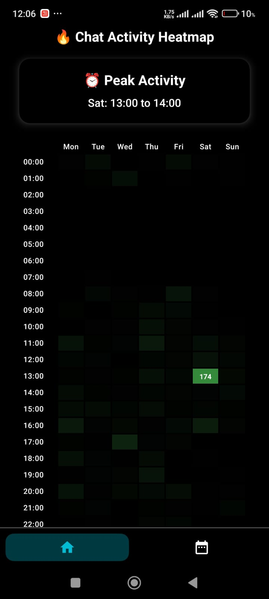

# 📱 WhatsApp Chat Analyzer

## 📌 Overview

WhatsApp Chat Analyzer is an Android application that performs **in-depth analysis of exported WhatsApp chats** — including **group conversations, one-to-one chats, and selected participants** — to extract meaningful insights, statistics, and usage patterns.

The application is built using **Kotlin for Android** and **Python for data processing** (integrated via **Chaquopy**), combining a smooth mobile UI with a powerful data analytics backend.

---

## 🚀 Key Features

### 📊 Comprehensive Chat Analytics
- Supports full chat export parsing (group chats, individual chats, or filtered participants).
- Provides detailed statistics such as:
  - Total number of messages
  - Most active participants
  - Count of media files (images, videos, stickers, etc.)
  - Word frequency and emoji usage analysis

### ⏰ Temporal Insights
- Hour-wise activity distribution
- Most active days and periods
- Longest messages and average message length statistics

### 🔍 Advanced Filtering
- Media-only message analysis
- Date-range based filtering
- Participant-wise message analysis

### 📈 Interactive Visualizations
- Includes heatmaps, bar charts, and pie charts for intuitive data interpretation
- Clean and minimal UI focused on clarity and usability

---

## 🛠 Technology Stack

| Purpose              | Technology Used        |
|----------------------|------------------------|
| 📱 Android App       | Kotlin                 |
| 🧠 Data Processing   | Python (via Chaquopy)  |
| 📁 File Handling     | Kotlin + Chaquopy      |
| 📊 Visualization     | MPAndroidChart         |
| 🧮 Computation       | Pandas, Regex (Python) |
| 🎨 UI/UX             | Android XML + Kotlin   |

---

## ⚙️ Installation & Usage

### 🔧 Prerequisites
- Android Studio (latest version recommended)
- Android device or emulator (Android 8.0+)
- WhatsApp chat exported in `.txt` format

---

---
## 📸 App Screenshots

<table>
  <tr>
    <td></td>
    <td></td>
  </tr>
  <tr>
    <td></td>
    <td></td>
  </tr>
  <tr>
    <td></td>
    <td></td>
  </tr>
  <tr>
    <td></td>
    <td></td>
  </tr>
  <tr>
    <td></td>
    <td></td>
  </tr>
</table>

### 📥 Installation Steps

1. Clone the repository:

bash git clone https://github.com/namankhatakdotcpp/WhatsAppChatAnalyser.git

2. Open the **WhatsApp Chat Analyzer** app.

3. Select the exported `.txt` chat file using the file picker.

4. Choose analysis mode:
   - Full chat analysis
   - Participant-wise analysis
   - Date-range filtering
   - Media-only analysis

5. View:
   - Statistics dashboard
   - Activity heatmaps
   - Message and media insights
   - User-wise comparisons

---

### 🧠 Internal Working (High-Level)

- Kotlin handles UI, file selection, and chart rendering.
- Chat file is passed to Python via **Chaquopy**.
- Python scripts process the data using **Pandas and Regex**.
- Results are sent back to Kotlin and visualized using **MPAndroidChart**.

---
## 👨‍💻 Created By

**Naman Khatak**

---

